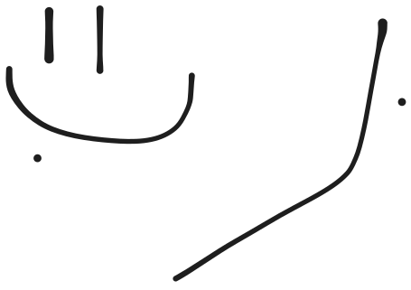

# Code notes

## 2025-10-17

For parallel processing, using joblib's Parallel and delayed is much simpler than multiprocessing.Pool. Just wrap the function call in delayed() and pass to Parallel.

Tried using ternary-plot but found mpternary worked much better.

## 2025-10-26

Using ternary plots works well but it is important to provide contextual side plots that show a selection from the ternary location in actual space.

For example for melt contribution plots show a side plot of what each ternary space plot looks like on a map.

Similarly having bands of satalite latitude ranges showing what is being sampled by different plots can help contextualise the differences seen in distribution ternary plots.

## 2025-11-01 14:48

Workflow for traditional methods:

... Forward problem?
